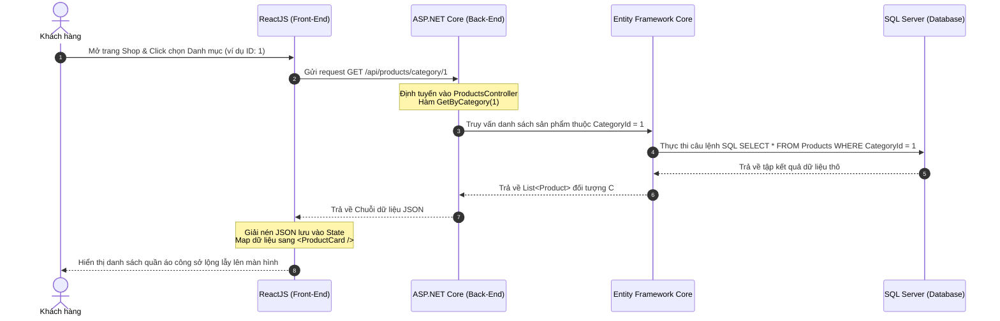
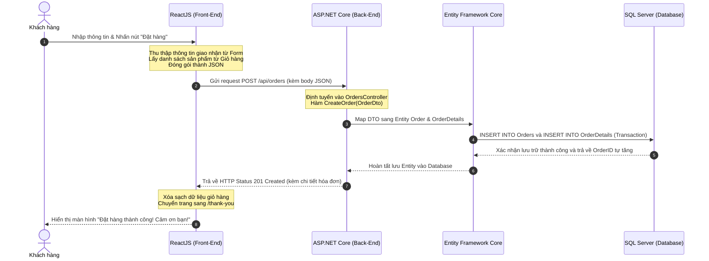

# HƯỚNG DẪN TỔ CHỨC CẤU TRÚC THƯ MỤC REACTJS VÀ KẾT NỐI 5 CỤM API CỐT LÕI

Tài liệu này hướng dẫn cách áp dụng một Template HTML/CSS có sẵn vào dự án ReactJS theo cấu trúc module hóa, đồng thời giải thích chi tiết logic bóc tách dữ liệu và kết nối với 5 cụm Web API cơ bản ở Backend (ASP.NET Core / SQL Server).

---

## I. Cấu Trúc Thư Mục ReactJS (Modular Structure)

Khi đưa một template giao diện (HTML/CSS/JS) vào ReactJS, việc tổ chức thư mục khoa học giúp dễ quản lý, tái sử dụng các thành phần và bảo trì mã nguồn lâu dài. Dưới đây là cấu trúc đề xuất:

```text
src/
│
├── assets/                  # Tài nguyên tĩnh kế thừa từ Template
│   ├── css/                 # Các file CSS chung (bootstrap, custom style,...)
│   ├── images/              # Hình ảnh mẫu, logo, banner
│   └── js/                  # Các file JS bổ trợ hiệu ứng từ template (nếu có)
│
├── components/              # Các thành phần giao diện nhỏ, tái sử dụng nhiều lần
│   ├── Header.jsx           # Thanh menu điều hướng phía trên
│   ├── Footer.jsx           # Chân trang hiển thị thông tin cửa hàng
│   ├── ProductCard.jsx      # Thẻ hiển thị sản phẩm (Ảnh, Tên, Giá, Nút Mua)
│   └── NewsCard.jsx         # Thẻ hiển thị bài viết/tin tức thời trang
│
├── pages/                   # Các trang giao diện lớn (Ghép từ các components)
│   ├── Home.jsx             # Trang chủ (Banner, Sản phẩm nổi bật, Tin tức xu hướng)
│   ├── Shop.jsx             # Trang cửa hàng (Danh sách sản phẩm kèm bộ lọc danh mục)
│   ├── ProductDetail.jsx    # Trang chi tiết sản phẩm (Chất liệu, phom dáng, chọn size, số lượng)
│   ├── Cart.jsx             # Trang giỏ hàng (Xem danh sách đã chọn, cập nhật số lượng, tính tổng tiền)
│   └── Checkout.jsx         # Trang thanh toán (Form nhập thông tin và xác nhận đặt hàng)
│
├── App.jsx                  # Cấu hình định tuyến đường dẫn (React Router DOM)
├── main.jsx                 # Điểm khởi đầu của ứng dụng React
└── index.css                # CSS toàn cục bổ sung
```

---

## II. Chi Tiết 5 Cụm Web API & Logic Xử Lý Trong ReactJS

Dưới đây là đặc tả chi tiết 5 cụm API và cách lập trình ReactJS để bóc tách dữ liệu tương ứng trên từng màn hình.

### 1. CỤM API BÀI VIẾT & TIN TỨC (POSTS API)

* **Vị trí hiển thị:** Trang chủ (`pages/Home.jsx`), Chân trang (`components/Footer.jsx`), Trang BlogDetail (nếu mở rộng).

#### 📑 Các Endpoint Cần Thiết
* `GET /api/posts`: Lấy toàn bộ danh sách bài viết tin tức.
* `GET /api/posts/{id}`: Xem chi tiết một bài viết cụ thể dựa trên ID.

#### 💡 Logic Xử Lý trên ReactJS
1. **Tại `pages/Home.jsx`:**
   * Sử dụng hook `useEffect` và thư viện `axios` (hoặc `fetch`) để gọi API `GET /api/posts` ngay khi trang được tải.
   * Dữ liệu nhận về được lưu vào React State (`const [posts, setPosts] = useState([])`).
   * Sử dụng hàm `.map()` để duyệt qua danh sách bài viết và render ra danh sách các thẻ `<NewsCard key={post.id} post={post} />`.
2. **Tại `pages/BlogDetail.jsx` (Xem chi tiết):**
   * Khi người dùng click vào thẻ tin tức, chuyển hướng sang `/blog/:id`.
   * Sử dụng hook `useParams()` của `react-router-dom` để lấy `id` từ URL.
   * Gọi API `GET /api/posts/{id}` để hiển thị chi tiết nội dung. Nếu nội dung lưu dưới dạng mã HTML, có thể render bằng thuộc tính `dangerouslySetInnerHTML={{ __html: post.content }}`.

```jsx
// Ví dụ minh họa trong pages/Home.jsx
import React, { useEffect, useState } from 'react';
import axios from 'axios';
import NewsCard from '../components/NewsCard';

function Home() {
  const [posts, setPosts] = useState([]);

  useEffect(() => {
    axios.get('https://localhost:7000/api/posts')
      .then(response => setPosts(response.data))
      .catch(error => console.error("Lỗi lấy danh sách bài viết:", error));
  }, []);

  return (
    <div className="news-section">
      <h2>Xu Hướng Thời Trang Mới Nhất</h2>
      <div className="news-grid">
        {posts.map(post => (
          <NewsCard key={post.id} post={post} />
        ))}
      </div>
    </div>
  );
}
```

---

### 2. CỤM API DANH MỤC SẢN PHẨM (CATEGORIES PRODUCTS API)

* **Vị trí hiển thị:** Thanh menu chính (`components/Header.jsx`), Sidebar bộ lọc tại trang cửa hàng (`pages/Shop.jsx`).

#### 📑 Endpoint Cần Thiết
* `GET /api/CategoriesProducts`: Lấy danh sách toàn bộ danh mục sản phẩm (Ví dụ: *Thời trang Công sở Nữ (ID=1)*, *Đầm Dạ hội Quý phái (ID=2)*, *Vest & Âu phục Nam (ID=3)*).

#### 💡 Logic Xử Lý trên ReactJS
1. **Tạo bộ lọc tự động:**
   * Component `<Header />` hoặc Sidebar của `Shop.jsx` gọi API này để lấy danh sách danh mục.
   * React sẽ render danh sách danh mục thành các nút bấm hoặc liên kết điều hướng.
2. **Kích hoạt sự kiện lọc:**
   * Khi người dùng bấm vào danh mục "Đầm Dạ hội Quý phái", ReactJS sẽ lưu `categoryId` (ví dụ: `2`) vào state `selectedCategoryId` hoặc cập nhật URL params `/shop?category=2`.
   * State thay đổi sẽ kích hoạt hiệu ứng gọi cụm API Sản phẩm theo danh mục tương ứng.

```jsx
// Ví dụ minh họa Sidebar lọc tại pages/Shop.jsx
import React, { useEffect, useState } from 'react';
import axios from 'axios';

function Sidebar({ onSelectCategory }) {
  const [categories, setCategories] = useState([]);

  useEffect(() => {
    axios.get('https://localhost:7000/api/CategoriesProducts')
      .then(response => setCategories(response.data))
      .catch(error => console.error("Lỗi lấy danh mục:", error));
  }, []);

  return (
    <aside className="sidebar">
      <h3>Danh Mục Sản Phẩm</h3>
      <ul>
        <li onClick={() => onSelectCategory(null)}>Tất cả sản phẩm</li>
        {categories.map(cat => (
          <li key={cat.id} onClick={() => onSelectCategory(cat.id)}>
            {cat.name}
          </li>
        ))}
      </ul>
    </aside>
  );
}
```

---

### 3. CỤM API SẢN PHẨM THỜI TRANG (PRODUCTS API)

* **Vị trí hiển thị:** Trang cửa hàng (`pages/Shop.jsx`), Component thẻ sản phẩm (`components/ProductCard.jsx`), Trang xem chi tiết sản phẩm (`pages/ProductDetail.jsx`).

#### 📑 Các Endpoint Cần Thiết
* `GET /api/products/category/{categoryId}`: Lấy danh sách sản phẩm thuộc danh mục chỉ định.
* `GET /api/products/{id}`: Lấy chi tiết thông tin của một sản phẩm.

#### 💡 Logic Xử Lý trên ReactJS
1. **Tại `pages/Shop.jsx`:**
   * Lắng nghe biến state `selectedCategoryId`. Mỗi khi biến này thay đổi, gọi API:
     * Nếu có ID danh mục: `GET /api/products/category/${selectedCategoryId}`
     * Nếu không có (chọn Tất cả): `GET /api/products` (hoặc tương tự)
   * Phân rã dữ liệu nhận được và truyền xuống thẻ `<ProductCard key={product.id} product={product} />` dưới dạng **Props**.
2. **Tại `components/ProductCard.jsx`:**
   * Nhận prop `product` và bóc tách các trường: `product.imageUrl` (hiển thị ảnh), `product.name` (tên sản phẩm), `product.price` (định dạng tiền tệ VNĐ).
3. **Tại `pages/ProductDetail.jsx`:**
   * Dùng `useParams()` để lấy ID sản phẩm từ thanh địa chỉ.
   * Gọi `GET /api/products/${id}` để lấy các chi tiết sâu hơn như `description` (phom dáng, chất liệu), và `stockQuantity` (số lượng trong kho). Hiển thị trạng thái "Hết hàng" nếu `stockQuantity === 0`.

```jsx
// Ví dụ minh họa Component ProductCard.jsx
import React from 'react';
import { Link } from 'react-router-dom';

function ProductCard({ product }) {
  return (
    <div className="product-card">
      
      <h3>{product.name}</h3>
      <p className="price">{product.price.toLocaleString('vi-VN')} đ</p>
      <div className="actions">
        <Link to={`/product/${product.id}`} className="btn-detail">Xem chi tiết</Link>
        <button className="btn-add-cart">Mua ngay</button>
      </div>
    </div>
  );
}
```

---

### 4. CỤM API KHÁCH HÀNG & XÁC THỰC (CUSTOMERS & AUTHENTICATION API)

* **Vị trí hiển thị:** Form đăng nhập/Đăng ký, Trang cá nhân, Trang thanh toán (`pages/Checkout.jsx`).

#### 📑 Endpoint Cần Thiết
* `POST /api/customers/login`: Gửi thông tin đăng nhập bao gồm `{ email, password }`. Trả về token xác thực hoặc thông tin khách hàng (Ví dụ: `id: 902`, `name: "Lê Ngọc Mai"`, `phone: "0987654321"`, `address: "123 Nguyễn Trãi, Quận 1"`).

#### 💡 Logic Xử Lý trên ReactJS
1. **Xác thực và lưu trữ:**
   * Khi khách hàng điền form đăng nhập và nhấn "Đăng nhập", ReactJS thực hiện gọi POST API.
   * Nếu xác thực thành công, lưu thông tin khách hàng vào `localStorage` hoặc `sessionStorage`:
     `localStorage.setItem('currentUser', JSON.stringify(response.data));`
2. **Tự động điền dữ liệu (Auto-fill) tại `pages/Checkout.jsx`:**
   * Khi người dùng truy cập trang thanh toán, kiểm tra xem có thông tin user trong `localStorage` hay không.
   * Nếu có, tự động đổ dữ liệu `name`, `phone`, `address` vào các ô Input tương ứng để khách hàng không phải gõ lại từ đầu.

```jsx
// Ví dụ minh họa auto-fill tại pages/Checkout.jsx
import React, { useEffect, useState } from 'react';

function Checkout() {
  const [shippingInfo, setShippingInfo] = useState({
    customerId: '',
    fullName: '',
    phone: '',
    address: '',
    notes: ''
  });

  useEffect(() => {
    const user = JSON.parse(localStorage.getItem('currentUser'));
    if (user) {
      setShippingInfo(prev => ({
        ...prev,
        customerId: user.id,
        fullName: user.name,
        phone: user.phone || '',
        address: user.address || ''
      }));
    }
  }, []);

  const handleChange = (e) => {
    setShippingInfo({ ...shippingInfo, [e.target.name]: e.target.value });
  };

  return (
    <form className="checkout-form">
      <input type="text" name="fullName" value={shippingInfo.fullName} onChange={handleChange} placeholder="Họ và tên" />
      <input type="text" name="phone" value={shippingInfo.phone} onChange={handleChange} placeholder="Số điện thoại" />
      <input type="text" name="address" value={shippingInfo.address} onChange={handleChange} placeholder="Địa chỉ giao hàng" />
      <textarea name="notes" value={shippingInfo.notes} onChange={handleChange} placeholder="Ghi chú đơn hàng" />
    </form>
  );
}
```

---

### 5. CỤM API XỬ LÝ ĐƠN HÀNG (ORDERS & ORDER DETAILS API)

* **Vị trí hiển thị:** Trang giỏ hàng (`pages/Cart.jsx`), Trang hoàn tất thanh toán (`pages/Checkout.jsx`).

#### 📑 Endpoint Cần Thiết
* `POST /api/orders`: Tạo mới hóa đơn kèm chi tiết đơn hàng (lưu thông tin đơn hàng và liên kết trực tiếp vào cơ sở dữ liệu SQL Server).

#### 💡 Logic Xử Lý trên ReactJS
1. **Lập giỏ hàng (Cart State):**
   * Giỏ hàng được quản lý tập trung (sử dụng Context API, Redux hoặc lưu tạm trong `localStorage`).
   * Mỗi item trong giỏ có dạng: `{ productId, quantity, price }`.
2. **Gửi đơn đặt hàng tại `pages/Checkout.jsx`:**
   * Khi người dùng nhấn nút "Xác nhận đặt hàng", ReactJS sẽ gom thông tin khách hàng từ Form nhập + danh sách sản phẩm trong giỏ hàng thành một cấu trúc JSON thích hợp.
   * Thực hiện gọi API `POST /api/orders` bằng axios.
   * Nếu Backend trả về trạng thái thành công, tiến hành xóa sạch giỏ hàng hiện tại (`localStorage.removeItem('cart')`) và chuyển hướng người dùng sang trang thông báo đặt hàng thành công (`/thank-you`).

```jsx
// Cấu trúc gói tin JSON gửi lên API
const orderPayload = {
  customerId: shippingInfo.customerId || null, // Có thể để null nếu khách hàng vãng lai
  customerName: shippingInfo.fullName,
  phone: shippingInfo.phone,
  address: shippingInfo.address,
  notes: shippingInfo.notes,
  cartItems: cart.map(item => ({
    productId: item.id,
    quantity: item.quantity,
    price: item.price
  }))
};

// Gọi API gửi lên Backend ASP.NET Core
axios.post('https://localhost:7000/api/orders', orderPayload)
  .then(response => {
    alert("Đặt hàng thành công!");
    clearCart(); // Xóa sạch giỏ hàng trong React State và LocalStorage
    navigate('/thank-you');
  })
  .catch(error => {
    console.error("Lỗi khi tạo đơn hàng:", error);
    alert("Đã xảy ra lỗi, vui lòng thử lại!");
  });
```

---

## III. Sơ Đồ Luồng Đi Của Dữ Liệu (Data Flow Diagram)

Dưới đây là sơ đồ thể hiện luồng đi của dữ liệu từ thao tác của khách hàng trên giao diện ReactJS, đi qua Server API (ASP.NET Core / Entity Framework Core) để tương tác với Cơ sở dữ liệu SQL Server và trả ngược kết quả lại màn hình.

### 1. Luồng Lấy Sản Phẩm Theo Danh Mục (Shop.jsx)



### 2. Luồng Gửi Đặt Hàng (Checkout.jsx)



---

> [!TIP]
> **Lời khuyên cho sinh viên:** 
> * Sử dụng các công cụ như **Postman** hoặc giao diện **Swagger** của ASP.NET Core để kiểm thử các Endpoint API độc làm trước khi tiến hành viết code kết nối (Fetch/Axios) trên ReactJS.
> * Hãy cấu hình **CORS (Cross-Origin Resource Sharing)** ở Backend ASP.NET Core (`Program.cs`) để cho phép ReactJS (thường chạy ở port `http://localhost:5173` hoặc `3000`) có quyền gửi yêu cầu HTTP lấy dữ liệu.
